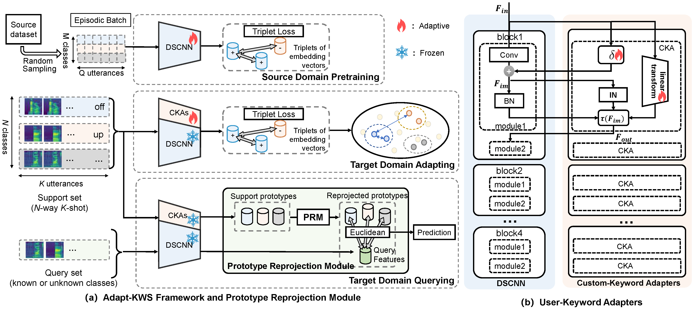

# <div align="center">Adapt-KWS

<div align="center">
  <a href="https://asvp.ee.scut.edu.cn/13293/list.htm"> </a>
  <a href="https://ieeexplore.ieee.org/document/10888051"> </a>
<p></p>


<a href="https://ieeexplore.ieee.org/document/10888051"> <b>Cross-Domain Few-Shot Open-Set Keyword Spotting Using  Keyword Adaptation and Prototype Reprojection</b> </a>

<b>International Conference on Acoustics, Speech and Signal Processing (ICASSP), 2025</b>

:star: Official code of the Adapt-KWS.
</div>

## <div align="center">:speaker:Introduction</div>

<!-- LGGPT is an LLM-based model that unifies arbitrary tasks and multiple domains of layout generation. It is developed based on GPT2-XL (1.5B parameters), which proves that LLM of such a small scale can achieve competitive layout generation performance across various tasks and multiple layout domains. -->

We provide the scripts for:
* **Source Domain Pretraining:** pretrain the DSCNN on a large-scale source domain dataset ([MSWC](https://mlcommons.org/en/multilingual-spoken-words/)) to develop a robust feature encoder. 
* **Target Domain Adapting:** integrate the pretrained DSCNN and CKAs, where the DSCNN is frozen and the CKAs are optimized from scratch using the support set.
* **Target Domain Querying:** perform the open-set classification by comparing the Euclidean distance between the reprojected prototypes and the query feature.



<div align="center"><i>Overall framework of Adapt-KWS. </i></div>

## <div align="center">:hammer_and_pick:Environment</div>

```bash
git clone https://github.com/Raynaming/CD-FSOS-KWS.git
cd CD-FSOS-KWS
conda create -n adapt_kws python=3.7.12
conda activate adapt_kws
pip install -r requirements.txt
```

## <div align="center">:bulb:Data Preparation</div>

Create a new folder termed `<dataset_path>`, download and process the source and target dataset by following the instructions below. Note that additive noise from the DEMAND dataset is used at training time. 

#### Multilingual Spoken Words Corpus (MSWC) 
- Simply [download](https://mlcommons.org/en/multilingual-spoken-words/) and unpack the engish partition inside the `<dataset_path>`. Audio files will be in `<dataset_path>/MSWC/en/clips/`
- Convert the audio files to .opus to .wav and store to the outputs to `<dataset_path>/MSWC/en/clips_wav/`. This will fasten the file loads at runtime (no uncompress is needed) at the cost of a higher memory storage. If this step is not done, modify the folder name at line 390 of the `MSWCData.py` file
- Put the split csv files (`en_{train,test,dev}.csv`) to the `<dataset_path>/MSWC/en/` folder
- Add the noise folder to sample the noise recordings: `<dataset_path>/MSWC/noise/`. We used samples from the [DEMAND](https://zenodo.org/record/1227121) dataset, only copying the wav file with ID=01 of every noise type to the destination folder (the name of the file is the destination folder can be any).

#### Google Speech Commands (GSC)
- The Google Speech Command dataset v2 is unpacked to `<dataset_path>/GSC/`. 
- Any link for download can be used (e.g. [torchaudio](https://pytorch.org/tutorials/intermediate/speech_command_classification_with_torchaudio_tutorial.html)).

#### Dysarthric speech database for universal access research (UA-Speech)
- Send e-mail to [uaspeech-requests](uaspeech-requests@lists.illinois.edu) to obtatining a copy of the UA-Speech dataset.
- Unpack the noisereduce versions of UA-Speech dataset to `<dataset_path>/UASpeech/` and individual speakers' audio folders will be located in `<dataset_path>/UASpeech/audio/noisereduce/`

#### Mandarin Dysarthria Speech Corpus (MDSC)
- [Download](https://www.aishelltech.com/AISHELL_6B) the Mandarin Dysarthria Speech Corpus and unpack it to `<dataset_path>/MDSC/`. 
- The audio files for each speaker will be located in `<dataset_path>/MDSC/wav/`, and the corresponding transcript information can be found in `<dataset_path>/MDSC/transcript/`.


Finally, the `<dataset_path>` could be the following format: 
```bash
dataset_path
├── MSWC
│   ├── en
│   │    ├──en_dev.csv
│   │    ├──en_test.csv
│   │    ├──en_train.csv
│   │    └──clips
│   └── noise
│        └──ch01.wav
├── GSC
│   └── speech_commands_v0.02
├── UASpeech
│   ├── audio
│   ├── doc
│   ├── mlf
│   ├── video
│   └── ...
├── MDSC
│   ├── transcript
│   └── wav
```


<!-- We also provide a well-processed training data used in the training of the paper, which can be downloaded from the these links ([Baidu Cloud](https://pan.baidu.com)) and directly used for training.  -->

## <div align="center">:rocket:Source Domain Pretraining</div>

To pretrain the backone on the MSWC dataset, you can run:
```
python source_pretraining.py --data.cuda \
--speech.default_datadir <dataset_path>/MSWC/en/ \
--train.epochs 40  \
--train.n_way 80 \
--train.n_query 20 \
--train.n_episodes 400  \
--log.exp_dir <output_dir>/<EXP_NAME>
```
Make sure to set: `<dataset_path>` and `<output_dir>/<EXP_NAME>`. 
You can use the command above to generate the trained model provided as an example in `results/Pretrain_DSCNN_MSWC`. 

**Main Training Options:**
- `train.n_way`. Number of classes for training episodes.
- `train.n_query`. Number of samples per training episodes.
- `train.n_episodes`. Number of episodes for epoch.


## <div align="center">:chart_with_upwards_trend:Target adapting and querying​​</div>

```bash
python target_adapting_querying.py --data.cuda --choose_cuda 0 \
    --model.model_path results/Pretrain_DSCNN_MSWC/best_model.pt \
    --speech.dataset googlespeechcommand --speech.task GSC12,GSC22 \
    --speech.default_datadir <dataset_path>/GSC/speech_commands_v0.02/  \
    --speech.include_unknown \
    --fsl.test.batch_size 264 \
    --fsl.test.n_support 10 \
    --fsl.test.n_way 11 \
    --fsl.test.n_episodes 100 \
    --querying.prototype_reprojection
```

**Main Adapting and Querying Options:**

- `model.model_path`: The pretrained model's path. You can replace it with the path to your pretrained model.
- `speech.dataset`: The target dataset used for adapting and querying, including: `googlespeechcommand`, `UASpeech`, and `MDSC`.
- `speech.task`: Set according to `speech.dataset` as follows:`GSC12,GSC22`, `UASpeech12,UASpeech22`, `MDSC12,MDSC22`.
- `speech.default_datadir`: Set according to `speech.dataset` as follows:`<dataset_path>/GSC/speech_commands_v0.02/`, `<dataset_path>/UASpeech/`, `<dataset_path>/MDSC/`.

The test results are saved by default to the path specified in `model.model_path`.

## <div align="center">:bookmark_tabs:Citation</div>

```bibtex
@inproceedings{yang2025cross,
  title={Cross-Domain Few-Shot Open-Set Keyword Spotting Using Keyword Adaptation and Prototype Reprojection},
  author={Yang, Mingru and He, Qianhua and Huang, Jinxin and Chen, Yongqiang and Liu, Zunxian and Li, Yanxiong},
  booktitle={ICASSP 2025-2025 IEEE International Conference on Acoustics, Speech and Signal Processing (ICASSP)},
  pages={1--5},
  year={2025},
  organization={IEEE}
}
```

## <div align="center">:tea:Acknownoledge</div>

This work was partly supported by National Natural Science Foundation of China (62371195) and the Guangdong Science and Technology Foundation (2023A0505050116, 2022A1515011687).

And we acknowledge the following code repositories:
- https://github.com/mrusci/ondevice-fewshot-kws
- https://github.com/ArchitParnami/Few-Shot-KWS
- https://github.com/roman-vygon/triplet_loss_kws
- https://github.com/clovaai/voxceleb_trainer
- https://github.com/BoLiu-SVCL/meta-open/
- https://github.com/tyler-hayes/Embedded-CL
- https://github.com/MrtnMndt/OpenVAE_ContinualLearning
- https://github.com/Codelegant92/STC-ProtoNet

## <div align="center">:e-mail:Cotact</div>

Mingru Yang: eemryang@mail.scut.edu.cn

